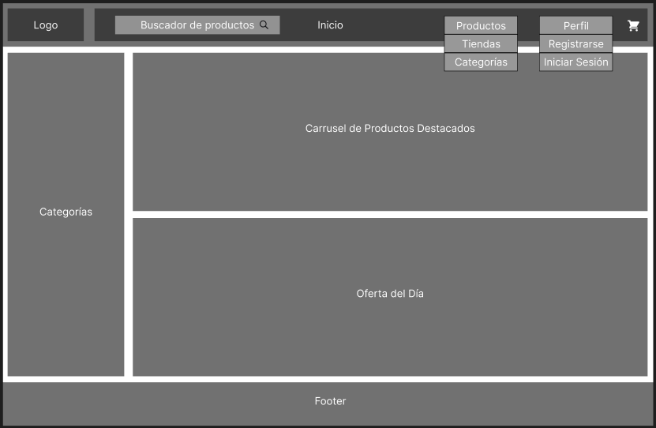
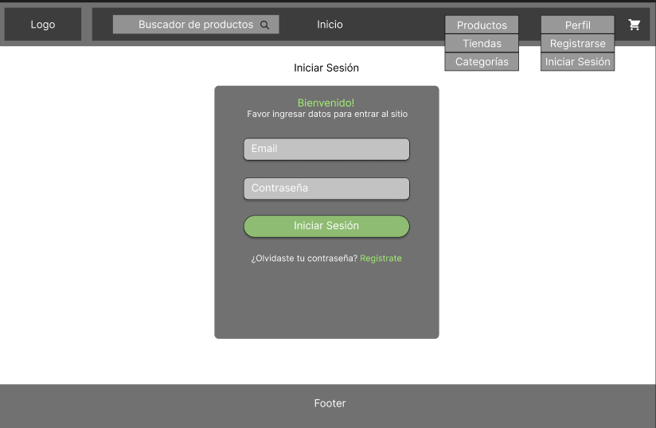
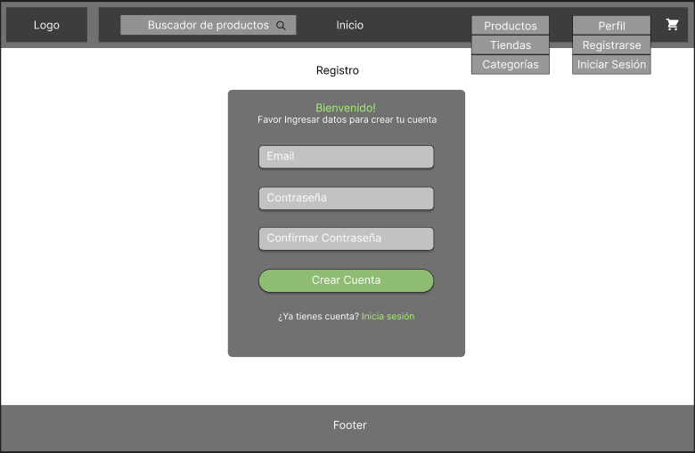
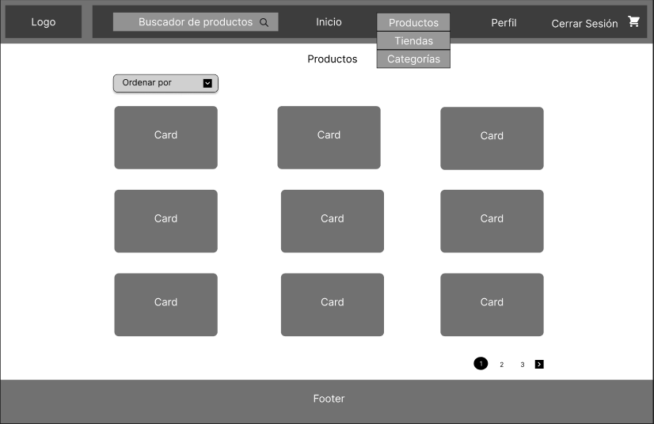
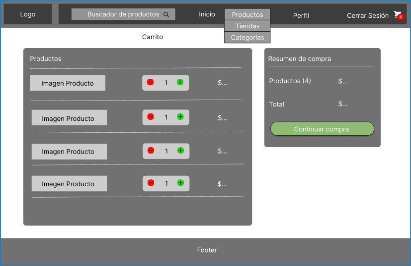
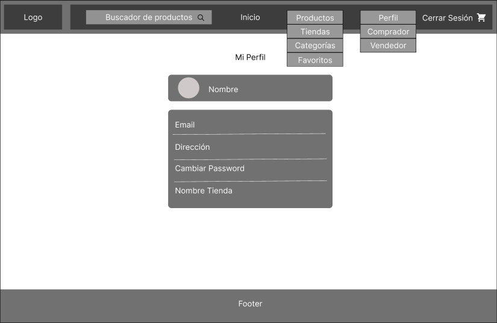
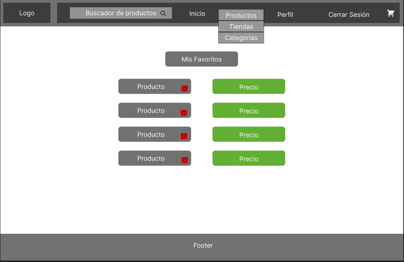

# Projecto Final

## Milestone 01

### Contexto

Un cliente nos ha encomendado desarollar una aplicación web tipo marketplace. Esta aplicación está dividida en cinco hitos:
1. Diseño y Prototipo
1. Desarrollo Frontend
1. Desarrollo Backend
1. Integración y Despliegue
1. Presentación del Proyecto

#### Requerimientos de este hito

* Diseño de UI.
* Definición de navegación entre vistas.
* Listado de dependencias a usar.
* Modelo entidad-relación para la base de datos.
* Contrato de datos de la API.

### Diseño Interfaz
 
 
 
 
 
 
 
 
 
 

### Navegación entre Vistas

### Dependencias

### Modelo Base de Datos

### Contrato de datos de API

### Autores

* [Julio Carvajal](https://github.com/jcartronics)
* [Nicolás González](https://github.com/NicolasGonzales-96)
* [Roberto Martínez](https://github.com/RobertoMartinezGuzman)
* [Patricio Parada](https://github.com/pelafustan)

### Agradecimientos

* Café negro.
* Té verde (cuando lele pansha).
* [Desafío Latam](https://desafiolatam.com/)
